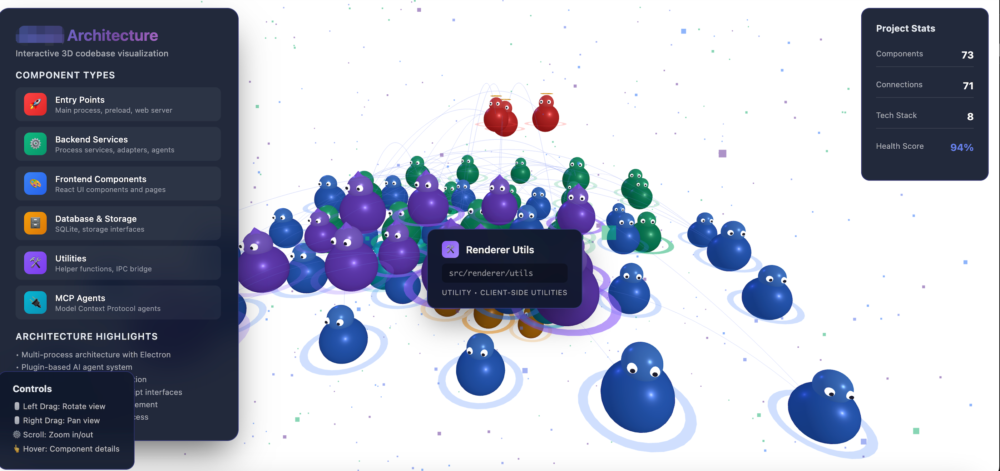

# CodeActor - 代码库拟人化可视化工具



将代码库转化为 3D 卡通角色剧场，每个模块变成一个可爱的角色，依赖关系变成社交网络。

## 功能亮点

- **8 种角色类型** - 自动识别 Main、Database、Utility、Middleware 等模式
- **6 种关系类型** - 强耦合、循环依赖、单向依赖等可视化
- **5 级健康系统** - 优秀/良好/亚健康/不健康/危险，颜色编码
- **多种输出格式** - JSON、Mermaid 图表、叙事文本
- **3D 可视化输出** - 生成可交互的 3D 场景 HTML
- **代码分析** - 自动识别模块层级、架构模式、技术债务

## 快速开始

### 作为 Claude Code Skill

**新功能**：分析完成后会自动提示是否启动 3D 可视化界面！

```bash
/code-actor
```

### 作为独立工具

```bash
# 分析当前目录
node dist/cli/index.js analyze .

# 导出 Mermaid 图表
node dist/cli/index.js analyze . --format=mermaid

# 导出叙事文本
node dist/cli/index.js analyze . --format=narrative

# 启动 Web 可视化服务器
node dist/cli/index.js serve .
```

## 输出格式

| 格式 | 说明 | 使用场景 |
|:----|:------|:----------|
| **json** | 完整分析数据 | API 集成、数据处理 |
| **mermaid** | Mermaid 关系图 | 文档生成、架构图 |
| **narrative** | 叙事文本 | 团队分享、项目介绍 |
| **visual** | 3D 可视化 HTML | Web 展示、交互探索 |

## 角色类型

| 性格 | 代码模式 | 颜色 |
|:----|:----------|:------|
| 🔥 热血主角 | Main/AppEntry | 红/橙 |
| 🛡️ 可靠支柱 | Database/Store | 蓝/青 |
| 💚 默默助手 | Utility/Common | 绿/青绿 |
| 🎪 古怪角色 | Middleware | 紫/粉 |
| 🌙 神秘人物 | Config/Constants | 深蓝/紫 |
| 🌸 脆弱灵魂 | 高 Bug 风险 | 黄/橙 |
| ⚡ 忙碌蜜蜂 | 高频调用模块 | 金/黄 |
| 🌑 孤独行者 | 孤立模块 | 灰/银灰 |

## 关系类型

| 关系 | 代码含义 | 风险 |
|:----|:----------|:------|
| 🔴 死党 | 强耦合（双向依赖） | 🔴 高风险 |
| 🟣 单恋 | 单向依赖 | 💚 低风险 |
| 🟠 禁忌之恋 | 循环依赖 | 🔴 高风险 |
| 🔵 匿名树洞 | 异步通信 | 💚 低风险 |
| 🟢 偶像崇拜 | 弱依赖 | 💚 低风险 |
| ⚪ 契约关系 | 接口依赖 | 💚 低风险 |

## 健康等级

| 等级 | 评分 | 视觉 |
|:----|:----|:----------|
| ✅ 优秀 | 90-100 | 绿色光环 |
| 💚 良好 | 75-89 | 青色光环 |
| ⚠️ 亚健康 | 60-74 | 黄色光环 |
| 🟠 不健康 | 40-59 | 橙色光环 |
| 🔴 危险 | 0-39 | 红色光环+闪烁 |

## 可视化交互

- **双击角色** - 高亮关系网络
- **拖拽角色** - 实时更新连接线
- **悬停** - 显示详细信息
- **滚轮缩放** - 缩放视图
- **代码大小影响** - 代码越多角色越大（最大 1.5x）

## 技术栈

- **Three.js** - 3D 渲染引擎
- **TypeScript** - 类型安全
- **Acorn** - JavaScript/TypeScript 代码解析
- **Express** - Web 服务器（可选）

## 使用场景

### 1. 快速代码 Review

```bash
/code-actor --format=narrative > review.md
cat review.md
```

### 2. 架构可视化

```bash
# 生成 3D 可视化
node dist/cli/index.js serve .

# 在浏览器打开 http://localhost:5173
```

### 3. CI/CD 集成

```yaml
# GitHub Actions 示例
- name: Code Review
  run: npx @your-org/code-actor analyze --format=json
```

## 常见问题

<details>
<summary><b>Q: 支持哪些语言？</b></summary>

支持 JavaScript/TypeScript (.js, .ts, .jsx, .tsx) 和 Python (.py) 文件

</details>

<details>
<summary><b>Q: 如何解读角色性格？</b></summary>

角色性格基于文件命名模式和代码特征自动分配：
- Main/App/AppEntry → 热血主角
- Database/Store/Repository → 可靠支柱
- Util/Helper/Common → 默默助手
- Middleware/Adapter → 古怪角色
- Config/Constants → 神秘人物
- 高复杂度/Bug 密集 → 脆弱灵魂
- 高频调用模块 → 忙碌蜜蜂
- 无依赖模块 → 孤独行者

</details>

<details>
<summary><b>Q: 健康度如何计算？</b></summary>

综合评分 = 100 - Bug风险权重 - 复杂度权重 - 代码规模惩罚 + 调用次数奖励
- Bug 风险：最高扣 40 分
- 复杂度：最高扣 20 分
- 代码规模：超过 500 行开始扣分
- 被调用：最多加 10 分

</details>

---

MIT License - 可自由用于个人和商业项目
